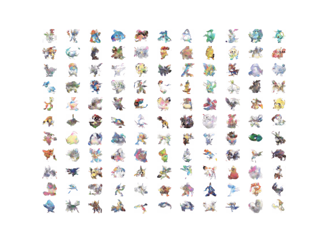

# PokemonGAN
Just creating new pokemons using GANs

model_weights: https://drive.google.com/file/d/1imVkCsjxOEMzwuITCkNsV6cUTQ0VBeAr/view?usp=sharing

Model: WGAN-GP

### Results

### Why do they look so bad?

I guess because there is not a simple structure of **what is a pokemon**. Every one is quite different from the other. For example, faces, they have quite similar structure (eyes, mouth, nose, ...) and a lot of variations. Pokemons only have variations and no similar structure. Thats pretty hard for a GAN to learn. But that's just a guess.

